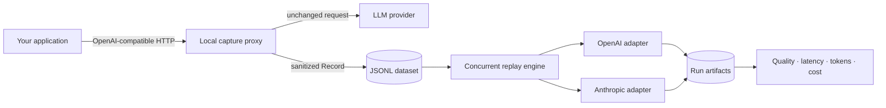

# LLM Replay

> **Before switching your production LLM: capture → replay → compare.**

[](https://github.com/ardao/llm-replay/actions/workflows/ci.yml)
[](https://go.dev/)
[](LICENSE)

LLM Replay is a local-first CLI for testing model migrations against
production-shaped workloads. Capture OpenAI-compatible traffic, replay the
same normalized dataset against OpenAI and Anthropic, then compare reliability,
structured-output correctness, latency, token usage, and estimated cost.

```text
RESULTS COMPARISON
Metric              openai/gpt-4o-mini  anthropic/claude-3-5-haiku
Success Rate        99.2%                98.3% (-0.9%)
JSON Validity       97.5%                99.2% (+1.7%)
Schema Adherence    95.8%                98.3% (+2.6%)
Exact Match         90.0%                92.5% (+2.8%)
Average Latency     684.2 ms             521.7 ms (-23.8%)
Estimated Cost      $0.014820            $0.019440 (+31.2%)
```

_Illustrative output; actual results depend on the selected models and data._

## Why LLM Replay?

Prompt playgrounds test hand-picked examples. Production migrations fail on
the long tail: unusual inputs, strict JSON consumers, latency spikes, provider
errors, and cost shifts. LLM Replay turns representative request/response pairs
into a repeatable regression suite so a model change can be measured before it
reaches users.

- **One workload, multiple providers.** OpenAI and Anthropic runs execute in
  parallel from the same provider-neutral JSONL dataset.
- **Useful quality signals.** JSON validity, JSON Schema adherence, and exact
  match sit beside success rate, latency percentiles, tokens, and cost.
- **Reproducible evidence.** Every run writes immutable configuration, result,
  and summary artifacts with a dataset SHA-256.
- **Local by default.** No hosted control plane and no telemetry pipeline.

## Five-minute quick start

Requirements: Git and Go 1.22 or newer.

```bash
git clone https://github.com/ardao/llm-replay.git
cd llm-replay
make build
make smoke
```

`make smoke` builds the CLI and replays all 120 synthetic support requests
against local OpenAI and Anthropic mock servers. It needs no API keys and makes
no provider calls.

Inspect the included dataset:

```bash
./bin/llm-replay inspect examples/datasets/support.jsonl
```

Run a real cross-provider comparison:

```bash
export OPENAI_API_KEY="your-openai-key"
export ANTHROPIC_API_KEY="your-anthropic-key"

./bin/llm-replay replay examples/datasets/support.jsonl \
  --model openai/gpt-4o-mini \
  --model anthropic/claude-3-5-haiku \
  --concurrency 5 \
  --timeout 30s
```

On Windows, use `bin\llm-replay.exe` and set environment variables with
PowerShell's `$env:OPENAI_API_KEY` and `$env:ANTHROPIC_API_KEY` syntax.

## How it works



The core operates on a stable normalized request model. Provider adapters own
wire-format translation and error normalization; the replay engine owns worker
pools, timeouts, retries, evaluations, and artifact generation.

## Capture traffic

Start the localhost-only reverse proxy:

```bash
./bin/llm-replay capture \
  --listen 127.0.0.1:8787 \
  --upstream https://api.openai.com \
  --output datasets/captured.jsonl
```

Point your application's OpenAI base URL to `http://127.0.0.1:8787/v1`.
Non-streaming `/chat/completions` requests are forwarded and appended to the
dataset without changing the response seen by the application.

## Replay and compare

Repeat `--model` for any supported candidate:

```bash
./bin/llm-replay replay dataset.jsonl \
  --model openai/model-a \
  --model anthropic/model-b \
  --eval json,schema,match \
  --retries 3 \
  --output runs
```

Each candidate creates an immutable `runs/run_*` directory containing:

| Artifact | Purpose |
| --- | --- |
| `config.json` | Model, dataset hash, concurrency, timeout, retry, and pricing configuration |
| `results.jsonl` | Per-record candidate response, metrics, evaluations, and normalized errors |
| `summary.json` | Aggregate reliability, latency, quality, tokens, and cost |

Compare previously completed runs without making network calls:

```bash
./bin/llm-replay compare runs/run_a runs/run_b
```

Export the same runs as one self-contained report that opens without a server
or internet connection:

```bash
./bin/llm-replay report runs/run_a runs/run_b --output comparison.html
```

For large result sets, start the read-only local explorer. It binds only to
your computer and opens the browser automatically:

```bash
./bin/llm-replay ui runs/run_a runs/run_b
```

Use `--no-browser` to print the local URL without opening it. Both commands
require runs from the same dataset and match their records by `record_id`.

## Compare live in the Arena

For a quick, one-prompt comparison, start the local Live Arena. The command
opens a browser workspace where you select two server-allowlisted models, enter
the prompt, and review both responses, latency, token use, estimated cost,
evaluations, and a bounded text diff:

```bash
make arena
```

Set the API key for each provider you want to use before starting. With one
provider key, you can compare two models from that provider; with both
`OPENAI_API_KEY` and `ANTHROPIC_API_KEY`, you can compare across providers. The
UI remains local, while each comparison sends the entered messages to the two
selected providers and may incur provider charges. API keys are never sent to
the browser.

To make dataset capture available, explicitly choose an existing valid JSONL
file at startup:

```bash
make arena ARENA_ARGS="--dataset datasets/captured.jsonl"
```

The browser cannot choose a file path or enter an arbitrary model ID. It can
only select models from the embedded server allowlist and append a confirmed,
successful server-side result to the pre-opened dataset.

## Privacy by default

- The capture server refuses non-loopback bind addresses.
- `Authorization`, `Cookie`, `Set-Cookie`, and `X-Api-Key` values are never
  persisted; recognizable API keys and Bearer tokens are redacted from stored
  text.
- Datasets and run artifacts remain on the local filesystem.
- API keys are read from environment variables and are never printed.

Captured prompts can still contain sensitive business or customer data because
prompt content is the workload being recorded. Treat datasets as confidential,
review them before sharing, and follow your organization's retention policy.
See the [security and privacy design](docs/05-security-and-privacy.md).

## Development

```bash
make test       # race-enabled on Linux/macOS
make lint
make examples   # deterministically regenerate the 120-record fixture
make smoke      # build and run the offline cross-provider benchmark
make snapshot   # create local release archives with GoReleaser
```

The CI pipeline enforces formatting, `go vet`, race tests, lint, deterministic
fixtures, the offline smoke test, and a clean build. Version tags matching `v*`
publish checksummed Linux, macOS, and Windows archives through GoReleaser.

## Roadmap

- [x] Capture, inspect, concurrent replay, evaluation, metrics, and comparison
- [x] OpenAI and Anthropic cross-provider benchmarks
- [x] Reproducible demo, CI, smoke testing, and multi-platform releases
- [x] Offline HTML reports and a secure localhost run explorer
- [x] Secure local Live Arena for two-model comparisons and opt-in capture
- [ ] Streaming capture and replay
- [ ] Tool/function-call evaluation
- [ ] Additional provider adapters

The detailed design and future plans live in [docs](docs/index.md). Contributions
are welcome; read [CONTRIBUTING.md](CONTRIBUTING.md) before opening a pull
request.

## License

LLM Replay is available under the [MIT License](LICENSE).
